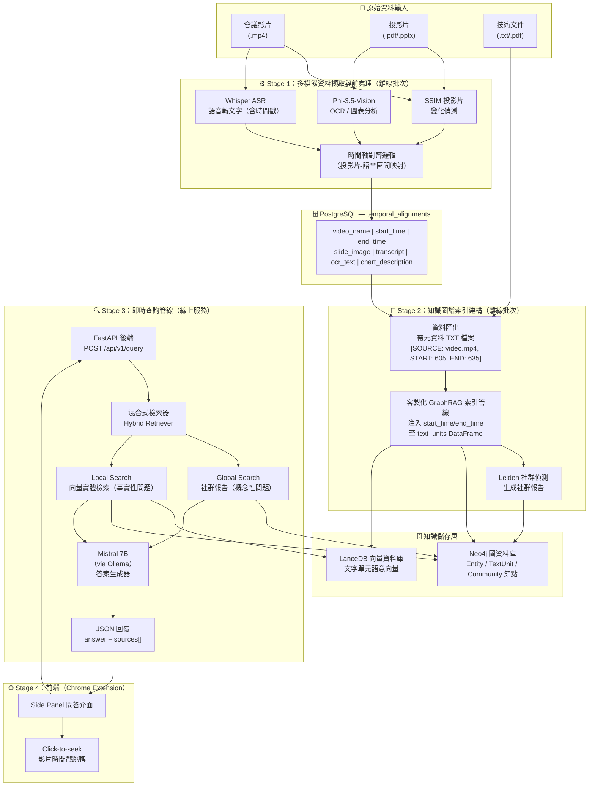
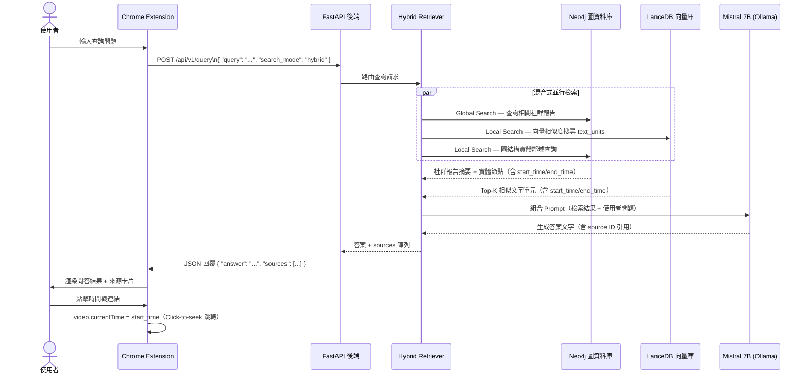
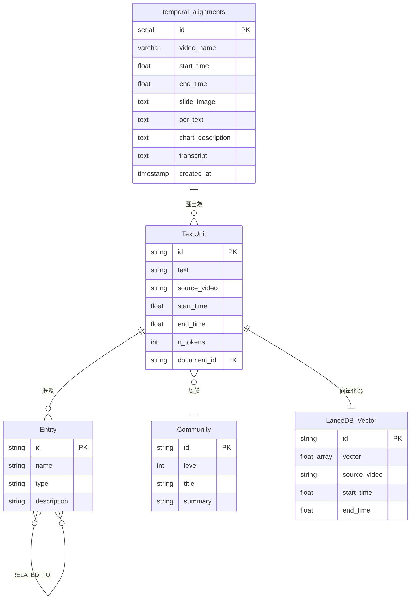
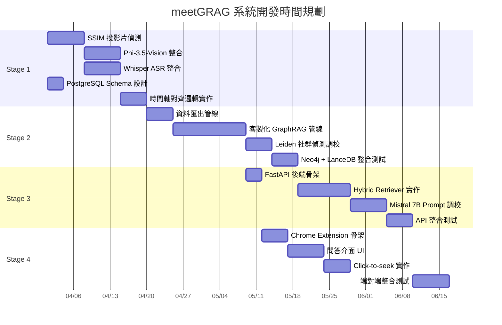

# 基於多模態圖譜推論的可溯源會議知識檢索系統 - 系統架構與需求

---

## 1. 專案目標

本專案旨在解決大型國際技術會議（如 W3C, IEEE, IETF）資料檢索困難的問題。透過結合視覺影像處理、語音辨識、視覺語言模型（Visual Language Model, VLM）與圖譜檢索增強生成（Graph Retrieval-Augmented Generation, GraphRAG）技術，建立一個具備高度可解釋性與可溯源性的知識檢索系統。

### 1.1 問題陳述

現有技術會議知識管理面臨以下三個核心痛點：

1. **資料高度分散**：會議知識散落於影片錄影（.mp4）、投影片（.pdf/.pptx）、逐字稿（.txt）三種異質媒體，缺乏統一的整合與對齊機制，使研究人員難以快速定位所需資訊。

2. **傳統向量 RAG 的推論局限**：基於餘弦相似度的向量檢索（Vector RAG）僅能找到語意相似的文字片段，無法建立實體間的邏輯關聯，導致「某項技術標準跨年份的演進脈絡」或「多份文件間的引用關係」等複雜推論任務無法有效完成。

3. **問答結果缺乏可溯源性**：現有系統的回覆無從驗證，使用者無法確認答案來自哪一場演講、哪一張投影片或哪一個時間點，嚴重降低了系統的可信度與實用性。

### 1.2 研究貢獻

本研究提出以下四項技術貢獻：

1. **多模態時間軸對齊管線**：融合結構相似度指標（Structural Similarity Index Measure, SSIM）投影片變化偵測、Whisper 語音時間戳與 PostgreSQL 時間對齊綱要，將三種模態的資訊統一整合於同一時間軸。

2. **注入可溯源性元資料的客製化 GraphRAG 索引流程**：對 Microsoft GraphRAG 標準索引管線進行關鍵修改，在 `text_units` DataFrame 中注入 `start_time`/`end_time` 欄位，確保可溯源性元資料從索引階段起即完整保存，並隨知識圖譜傳播至各節點。

3. **混合式檢索架構（Hybrid Retrieval）**：整合 GraphRAG 的 Global Search（社群報告層級的摘要性推論）與 Local Search（向量實體與文字單元的精確檢索），針對不同類型的問題自動選擇最適合的檢索策略。

4. **瀏覽器原生 Click-to-seek 可溯源介面**：透過 Chrome Extension 的側邊欄問答介面，讓使用者在取得回覆後可直接點擊時間戳，立即跳轉至瀏覽器中播放的原始影片對應片段，實現端對端的可溯源體驗。

### 1.3 適用場景

本系統針對大型國際標準化組織的會議資料設計，這類資料具備以下特性：

- **W3C（World Wide Web Consortium）**：技術規範討論密集、投影片多為文字與程式碼截圖、議題跨年份累積演進（如 CSS、HTML 標準的版本演進）。
- **IEEE（Institute of Electrical and Electronics Engineers）**：學術報告格式標準化、圖表技術含量高、跨領域交叉引用頻繁。
- **IETF（Internet Engineering Task Force）**：RFC 文件與演講內容高度關聯、多語言講者、技術術語密度極高。

---

## 2. 系統核心功能

### 2.1 多模態語意對齊（Multimodal Semantic Alignment）

自動化處理會議影片、簡報（PPT）、語音逐字稿及技術文件，並在時間軸上進行精準對齊。

- **技術對應**：以 SSIM 演算法（閾值 0.85–0.90）偵測投影片切換時間點；以 Whisper 語音辨識模型提取逐字稿及每個詞彙的精確時間戳（word-level timestamp）；最終以 PostgreSQL `temporal_alignments` 資料表儲存「投影片–語音區間」對應記錄，統一管理所有時間軸元資料。

### 2.2 圖譜檢索增強生成（GraphRAG）

超越傳統向量 RAG，透過知識圖譜建立實體間的邏輯關聯，支援「跨年份」、「跨文件」的複雜推論。

- **技術對應**：以 Leiden 社群偵測演算法（Community Detection）對知識圖譜進行社群劃分，生成多層次的社群報告（Community Reports）；以 Neo4j 圖資料庫儲存實體（Entity）、文字單元（TextUnit）與社群（Community）節點及其關聯；以 Microsoft GraphRAG 框架協調整體索引流程。

### 2.3 可溯源問答（Traceable Q&A）

每一條系統回覆皆可追蹤至原始影片片段、簡報頁面或文件段落。

- **技術對應**：FastAPI 後端回傳結構化 JSON 回覆，其中 `sources` 陣列的每個元素包含 `video_name`、`start_time`、`end_time`、`transcript_snippet`、`slide_image_url` 及 `relevance_score`，完整記錄每條答案的知識來源。

### 2.4 瀏覽器擴充功能（Browser Extension）

以 Chrome Extension 形式提供即時互動介面，支援側邊欄問答與影片章節跳轉。

- **技術對應**：採用 Chrome Extension Manifest V3 架構，使用 Side Panel API 提供非干擾式問答介面；以 JavaScript `fetch` API 與後端通訊；透過 `document.querySelector('video').currentTime = timestamp` 機制實現 Click-to-seek 影片跳轉功能。

---

## 3. 系統整體架構

### 3.1 架構設計原則

本系統架構遵循三項核心設計原則：

1. **模組化解耦**：各處理階段（資料擷取、索引建構、查詢服務、前端呈現）相互獨立，可獨立替換內部使用的模型（如將 Whisper 替換為其他 ASR 模型）而不影響其他模組。

2. **可溯源性優先（Traceability-first）**：可溯源性元資料（`source_video`、`start_time`、`end_time`）從資料擷取的第一步即嵌入，並貫穿整條處理管線，確保索引、檢索、生成各階段均不丟失來源資訊。

3. **離線索引與即時查詢分離**：知識圖譜索引（Offline Indexing Pipeline）與使用者問答（Online Query Pipeline）完全解耦，索引作業可在背景批次執行，不影響線上查詢服務的可用性。

### 3.2 系統資料流圖



### 3.3 查詢時序圖



---

## 4. 各模組詳細設計

### 4.1 自動化資料處理模組（Stage 1）

此模組負責將三種異質原始資料轉換為時間對齊的結構化文本，儲存於 PostgreSQL 資料庫，為後續知識圖譜建構提供統一且完整的知識基礎。

#### 4.1.1 投影片變化偵測子模組

採用結構相似度指標（SSIM）演算法，逐幀比較相鄰影片畫面，偵測投影片的切換時間點。

- **演算法原理**：SSIM 從亮度（Luminance）、對比度（Contrast）與結構（Structure）三個維度比較兩張影像，輸出介於 0 到 1 的相似度分數，分數越低代表差異越大。
- **閾值設定策略**：建議初始閾值設定為 0.87，若 SSIM 低於此值則判定為投影片切換。實際使用時應依據影片錄製品質（是否有淡入淡出轉場效果）進行調整，範圍建議在 0.85–0.90 之間。
- **邊際案例處理**：對於「淡入淡出」轉場（多幀漸變），採用滑動視窗偵測連續低分幀，取最低分幀的時間點作為切換點，避免誤判中間幀為多次切換。

#### 4.1.2 VLM 視覺分析子模組

使用 Phi-3.5-Vision 模型，對每張偵測到的獨立投影片截圖進行兩種類型的視覺分析。

- **OCR 模式**：提取投影片中的所有文字內容，包含標題、條列項目、程式碼片段。Prompt 設計要求模型以繁/英雙語輸出，並保留原始格式層次（標題 > 子項目）。
- **圖表分析模式**：對包含技術圖表、流程圖、架構圖的投影片，要求模型生成一段描述性文字，說明圖表的主旨、關鍵元件與關係。此描述文字作為 `chart_description` 欄位儲存，補充 OCR 文字無法表達的視覺語意。

#### 4.1.3 語音辨識子模組

採用 OpenAI Whisper 模型（建議 `large-v3`）將影片音訊轉換為帶有精確時間戳的逐字稿。

- **模型選擇**：`large-v3` 在多語言技術詞彙的辨識準確率最高，適合處理混有英文技術術語的中文演講，以及全程英文的國際會議。
- **時間戳精度**：採用 word-level timestamp 輸出，每個詞彙均附有對應的開始與結束秒數，支援後續的細粒度時間對齊。
- **多語言策略**：Whisper 自動偵測語言，對中英夾雜的演講可設定 `language=zh` 強制以中文為主語言辨識，同時保留英文專有名詞。

#### 4.1.4 時間軸對齊邏輯

將投影片切換時間點（來自 SSIM 偵測）與語音時間戳（來自 Whisper）進行區間配對，生成「投影片–語音區間」記錄。

**對齊演算法**：
1. 將投影片切換時間點序列 `[t₀, t₁, t₂, ..., tₙ]` 定義為區間邊界。
2. 對每個區間 `[tᵢ, tᵢ₊₁)`，收集所有開始時間落在此區間內的語音文字單元。
3. 合併為一筆記錄：`(video_name, slide_image, ocr_text, chart_description, transcript, start_time=tᵢ, end_time=tᵢ₊₁)`。
4. 寫入 PostgreSQL `temporal_alignments` 資料表。

---

### 4.2 知識圖譜索引建構模組（Stage 2）

此模組以 Stage 1 產出的 PostgreSQL 資料為輸入，透過客製化的 Microsoft GraphRAG 索引管線建構知識圖譜，同時確保可溯源性元資料貫穿整個索引過程。

#### 4.2.1 資料匯出與格式化

從 PostgreSQL 查詢 `temporal_alignments` 資料表，將每筆記錄匯出為 GraphRAG 索引管線所需的 TXT 格式文件，並在文件開頭嵌入結構化的元資料標注：

```
[SOURCE: W3C_CSS_2023.mp4, START: 605, END: 635]
CSS Grid Layout Working Group Discussion
The proposal for subgrid support was formally accepted...
（以下為 OCR 文字與逐字稿的合併內容）
```

此標注格式設計的核心目的在於：確保後續的 GraphRAG 索引管線在文字分塊（chunking）時，每個 `text_unit` 能從所在文件的開頭標注中繼承 `source_video`、`start_time`、`end_time` 資訊，實現可溯源性的零損耗傳播。

#### 4.2.2 客製化 GraphRAG 索引管線

這是本系統最核心的技術創新點。標準 Microsoft GraphRAG 索引流程不保存時間戳等自訂元資料，本模組對其進行以下關鍵修改：

**修改點 1 — 注入可溯源欄位至 text_units DataFrame**：
在 GraphRAG 的文字分塊（TextSplitter）步驟之後，截獲 `text_units` DataFrame，解析每個 text_unit 所屬文件開頭的 `[SOURCE: ..., START: ..., END: ...]` 標注，新增三個自訂欄位：

```python
text_units_df["source_video"] = text_units_df["document_id"].map(source_map)
text_units_df["start_time"]   = text_units_df["document_id"].map(start_map)
text_units_df["end_time"]     = text_units_df["document_id"].map(end_map)
```

**修改點 2 — 傳播元資料至下游節點**：
在實體擷取（Entity Extraction）與關係擷取（Relationship Extraction）步驟中，確保生成的 Entity 和 Relationship 節點記錄其來源 `text_unit_id`，從而間接保存對應的時間戳資訊。

#### 4.2.3 Leiden 社群偵測

Leiden 演算法將知識圖譜中的實體節點劃分為多層次的語意社群（Semantic Communities），並為每個社群生成一份自然語言摘要報告（Community Report）。

- **Resolution 參數**：控制社群粒度，數值越大社群越小且越精確，建議初始值為 1.0，依圖譜規模調整。
- **社群報告用途**：Global Search 模式下，系統直接以社群報告作為 LLM 的上下文輸入，支援高層次的「整體趨勢」、「跨年份演進」等概念性問題。
- **Leiden vs. Louvain**：Leiden 演算法保證每個社群內部的連通性，解決了 Louvain 演算法可能產生「孤立節點被誤分配至遠端社群」的問題，在大型技術知識圖譜上品質更穩定。

#### 4.2.4 圖譜結構設計

**節點類型（Node Types）**：

| 節點類型 | 關鍵屬性 | 說明 |
|---|---|---|
| `TextUnit` | `id`, `text`, `source_video`, `start_time`, `end_time`, `n_tokens` | 知識的最小可溯源單位 |
| `Entity` | `id`, `name`, `type`, `description`, `source_text_unit_ids[]` | 從 TextUnit 中擷取的實體 |
| `Relationship` | `id`, `source_entity`, `target_entity`, `description`, `weight` | 實體間的關係 |
| `Community` | `id`, `level`, `title`, `summary`, `text_unit_ids[]` | Leiden 演算法劃分的語意社群 |
| `Document` | `id`, `title`, `source_video`, `start_time`, `end_time` | 對應一個時間對齊的文件片段 |

**關係類型（Relationship Types）**：
- `(:Entity)-[:MENTIONED_IN]->(:TextUnit)`：實體被哪些文字單元提及
- `(:Entity)-[:RELATED_TO]->(:Entity)`：實體間的語意關係
- `(:Entity)-[:IN_COMMUNITY]->(:Community)`：實體所屬社群
- `(:TextUnit)-[:PART_OF]->(:Document)`：文字單元所屬文件

---

### 4.3 可溯源即時問答模組（Stage 3）

#### 4.3.1 混合式檢索架構

根據問題的性質，系統自動選擇或組合以下兩種檢索策略：

| 策略 | 適用問題類型 | 資料來源 | 範例問題 |
|---|---|---|---|
| **Global Search** | 概念性、摘要性、跨文件推論 | Neo4j 社群報告 | 「W3C 近三年對 CSS Grid 的整體立場是什麼？」 |
| **Local Search** | 事實性、具體細節、精確定位 | LanceDB 向量 + Neo4j 圖結構 | 「2023 年 IETF 第 117 次會議中哪個 RFC 草案被採納？」 |
| **Hybrid** | 需要整體背景又需精確細節的複合問題 | 兩者合併 | 「請說明 HTTP/3 的演進歷史，並指出最關鍵的技術轉折點。」 |

#### 4.3.2 答案生成器設計

Mistral 7B（透過 Ollama 本地部署）作為最終答案的生成模型。System Prompt 設計要點：

1. **強制引用**：要求模型在答案中以 `[SOURCE_ID: xxx]` 格式標注引用的來源 ID，後處理階段將此 ID 映射回時間戳資訊。
2. **拒絕幻覺**：指示模型若無法從提供的上下文中找到依據，應明確告知「依據現有資料無法確認」，不得自行推斷。
3. **語言一致性**：依據使用者問題的語言（中文或英文）以相同語言回覆。

#### 4.3.3 可溯源 JSON 回覆格式

```json
{
  "answer": "根據 2023 年 W3C TPAC 會議記錄，CSS Subgrid 規範...[SOURCE_ID: ts_001]...",
  "sources": [
    {
      "source_id": "ts_001",
      "video_name": "W3C_TPAC_2023_CSS.mp4",
      "start_time": 605.0,
      "end_time": 635.0,
      "transcript_snippet": "So the subgrid proposal has been formally...",
      "slide_image_url": "/static/slides/W3C_TPAC_2023_CSS_slide_42.png",
      "relevance_score": 0.92
    }
  ],
  "community_context": "CSS 佈局技術演進社群摘要...",
  "search_mode_used": "hybrid",
  "processing_time_ms": 2341
}
```

---

### 4.4 前端瀏覽器擴充功能模組（Stage 4）

#### 4.4.1 Chrome Extension Manifest V3 架構

```
extension/
├── manifest.json          # MV3 設定（side_panel, permissions）
├── background/
│   └── service_worker.js  # 後台服務（API 請求協調）
├── sidepanel/
│   ├── panel.html         # 側邊欄 HTML 結構
│   ├── panel.css          # 介面樣式
│   └── panel.js           # 問答邏輯與 Click-to-seek
└── content/
    └── content_script.js  # 注入影片頁面，監聽跳轉指令
```

主要使用 Chrome APIs：`chrome.sidePanel`、`chrome.tabs`、`chrome.runtime`。

#### 4.4.2 問答介面 UI

側邊欄採用對話式介面設計，每條系統回覆下方顯示來源卡片（Source Cards），卡片包含：
- 影片名稱與時間範圍（格式：`HH:MM:SS – HH:MM:SS`）
- 對應投影片截圖縮圖
- 逐字稿片段預覽（展開/收合）
- 可點擊的「跳至影片」按鈕

#### 4.4.3 Click-to-seek 實作

```javascript
// content_script.js
chrome.runtime.onMessage.addListener((message) => {
  if (message.type === 'SEEK_VIDEO') {
    const video = document.querySelector('video');
    if (video) {
      video.currentTime = message.timestamp;
      video.play();
    }
  }
});
```

**跨域限制處理**：Click-to-seek 功能僅在同一瀏覽器標籤頁中播放的影片上有效。對於需要先開啟影片頁面的情境，Extension 會引導使用者先在標籤頁中開啟對應影片，再執行跳轉操作。

---

## 5. 資料庫綱要設計

### 5.1 PostgreSQL — 時間對齊資料（`temporal_alignments`）

```sql
CREATE TABLE temporal_alignments (
    id                SERIAL PRIMARY KEY,
    video_name        VARCHAR(255)  NOT NULL,
    start_time        FLOAT         NOT NULL,
    end_time          FLOAT         NOT NULL,
    slide_image       TEXT,
    ocr_text          TEXT,
    chart_description TEXT,
    transcript        TEXT,
    created_at        TIMESTAMP DEFAULT NOW()
);

-- 支援時間範圍查詢的複合索引
CREATE INDEX idx_video_time ON temporal_alignments (video_name, start_time);
```

### 5.2 Neo4j — 知識圖譜

關鍵節點的 Cypher 屬性定義（`TextUnit` 是可溯源性的核心承載者）：

```cypher
// TextUnit 節點（帶有可溯源欄位）
CREATE (t:TextUnit {
  id:           "tu_001",
  text:         "The subgrid proposal was formally accepted...",
  source_video: "W3C_TPAC_2023_CSS.mp4",
  start_time:   605.0,
  end_time:     635.0,
  n_tokens:     128,
  document_id:  "doc_042"
})

// Entity 節點（透過 source_text_unit_ids 間接關聯時間戳）
CREATE (e:Entity {
  id:                   "ent_css_subgrid",
  name:                 "CSS Subgrid",
  type:                 "TECHNOLOGY",
  description:          "CSS Grid Layout Level 2 的子功能...",
  source_text_unit_ids: ["tu_001", "tu_023"]
})

// Community 節點（社群報告用於 Global Search）
CREATE (c:Community {
  id:           "comm_css_layout",
  level:        1,
  title:        "CSS 佈局技術演進社群",
  summary:      "本社群涵蓋 CSS Flexbox、Grid、Subgrid 的提案歷程...",
  text_unit_ids: ["tu_001", "tu_002"]
})
```

### 5.3 LanceDB — 語意向量資料

| 欄位 | 型別 | 說明 |
|---|---|---|
| `id` | `string` | 對應 Neo4j 的 `TextUnit.id` |
| `vector` | `float32[1024]` | 文字單元的語意嵌入向量 |
| `text` | `string` | 原始文字（供結果展示） |
| `source_video` | `string` | 來源影片名稱 |
| `start_time` | `float` | 片段開始秒數 |
| `end_time` | `float` | 片段結束秒數 |

**嵌入策略**：將 `ocr_text + "\n" + transcript` 拼接後作為嵌入輸入，使向量同時捕捉投影片視覺文字與語音內容的語意。

### 5.4 資料庫關係圖



---

## 6. API 設計

### 6.1 端點清單

| 方法 | 路徑 | 功能 | 認證 |
|---|---|---|---|
| `POST` | `/api/v1/query` | 主要問答端點 | 否 |
| `GET` | `/api/v1/sources/{source_id}` | 查詢特定來源詳情 | 否 |
| `GET` | `/api/v1/health` | 服務健康檢查 | 否 |
| `POST` | `/api/v1/ingest` | 觸發新資料批次索引（管理用） | API Key |

### 6.2 主要端點詳細設計

#### `POST /api/v1/query`

**Request Body**：

```json
{
  "query": "W3C 近三年對 CSS Grid 的整體立場是什麼？",
  "search_mode": "hybrid",
  "top_k": 5,
  "video_filter": ["W3C_TPAC_2023_CSS.mp4"]
}
```

| 欄位 | 型別 | 必填 | 說明 |
|---|---|---|---|
| `query` | `string` | ✓ | 使用者查詢問題 |
| `search_mode` | `"global"\|"local"\|"hybrid"` | 否 | 預設 `"hybrid"` |
| `top_k` | `integer` | 否 | 回傳來源數量，預設 `5` |
| `video_filter` | `string[]` | 否 | 限定特定影片，空陣列代表不限制 |

**Response Body（200 OK）**：

```json
{
  "answer": "根據 2023 年 W3C TPAC 會議記錄...",
  "sources": [
    {
      "source_id": "ts_001",
      "video_name": "W3C_TPAC_2023_CSS.mp4",
      "start_time": 605.0,
      "end_time": 635.0,
      "transcript_snippet": "So the subgrid proposal has been formally accepted...",
      "slide_image_url": "/static/slides/W3C_TPAC_2023_CSS_slide_42.png",
      "relevance_score": 0.92
    }
  ],
  "community_context": "CSS 佈局技術演進社群摘要...",
  "search_mode_used": "hybrid",
  "processing_time_ms": 2341
}
```

### 6.3 錯誤處理設計

所有錯誤均以統一 JSON 格式回傳：

```json
{
  "error": {
    "code": "QUERY_TOO_SHORT",
    "message": "查詢問題長度不得少於 5 個字元。",
    "http_status": 400
  }
}
```

| HTTP 狀態碼 | 錯誤碼 | 說明 |
|---|---|---|
| `400` | `QUERY_TOO_SHORT` | 查詢問題過短 |
| `400` | `INVALID_SEARCH_MODE` | search_mode 值不合法 |
| `404` | `SOURCE_NOT_FOUND` | 指定 source_id 不存在 |
| `503` | `LLM_UNAVAILABLE` | Ollama / Mistral 服務無法連線 |
| `503` | `DATABASE_UNAVAILABLE` | Neo4j 或 LanceDB 連線失敗 |

---

## 7. 技術棧彙整

| 類別 | 技術 / 工具 | 版本建議 | 用途 |
|---|---|---|---|
| **多模態模型** | Phi-3.5-Vision | Microsoft | 投影片 OCR 與圖表描述生成 |
| **多模態模型** | Whisper | OpenAI `large-v3` | 語音辨識與 word-level 時間戳擷取 |
| **語言模型** | Mistral 7B | via Ollama | 知識圖譜實體擷取與問答生成 |
| **圖譜框架** | Microsoft GraphRAG | 客製化修改版 | 知識圖譜索引管線協調 |
| **圖演算法** | Leiden Algorithm | via `graspologic` | 知識社群偵測與報告生成 |
| **圖資料庫** | Neo4j | Community Edition | 知識圖譜儲存、Cypher 查詢 |
| **向量資料庫** | LanceDB | — | 語意向量索引與 Top-K 檢索 |
| **關聯式資料庫** | PostgreSQL | 15+ | 時間對齊元資料集中管理 |
| **LLM 執行環境** | Ollama | — | 本地化部署 Mistral 7B |
| **後端框架** | FastAPI | Python 3.11+ | REST API 服務 |
| **前端** | Chrome Extension | Manifest V3 | 問答介面與 Click-to-seek |
| **影像相似度** | SSIM | `scikit-image` | 投影片變化偵測 |
| **評估框架** | Ragas | — | GraphRAG 系統效能量化評估 |

---

## 8. 系統實作階段規劃

### 8.1 四階段開發藍圖

| 階段 | 名稱 | 輸入 | 輸出 | 關鍵技術 | 驗收標準 |
|---|---|---|---|---|---|
| **Stage 1** | 多模態資料擷取與前處理 | `.mp4`, `.pdf`, `.txt` | PostgreSQL `temporal_alignments` | SSIM, Phi-3.5-Vision, Whisper | 時間戳對齊誤差中位數 < 2s |
| **Stage 2** | 知識圖譜索引建構 | PostgreSQL 資料 | Neo4j 圖譜 + LanceDB 向量庫 | GraphRAG（客製化）, Leiden | 圖譜實體涵蓋率 > 95% |
| **Stage 3** | 可溯源即時問答 API | 使用者查詢 | JSON（含 `sources[]`） | FastAPI, Hybrid Retriever, Mistral 7B | API P95 延遲 < 5s |
| **Stage 4** | Chrome Extension 前端 | API JSON 回覆 | 可互動瀏覽器介面 | Chrome Extension MV3 | Click-to-seek 跳轉正確率 100% |

### 8.2 階段依賴關係

```
Stage 1 ──────────────────────────────► Stage 2
（PostgreSQL 資料是圖譜建構的唯一輸入）      │
                                          │（Neo4j + LanceDB 是查詢服務的前提）
                                          ▼
                                       Stage 3 ──► Stage 4
                                    （FastAPI 是 Extension 的後端依賴）
```

### 8.3 開發甘特圖



---

## 9. 系統評估指標

### 9.1 使用 Ragas 框架的量化指標

以 Ragas 評估框架對系統的 RAG 管線品質進行量化評估：

| 指標 | 說明 | 目標值 | 評估方法 |
|---|---|---|---|
| **Faithfulness** | 答案對檢索內容的忠實程度（無幻覺） | > 0.85 | `ragas.metrics.faithfulness` |
| **Answer Relevancy** | 答案與查詢問題的相關性 | > 0.80 | `ragas.metrics.answer_relevancy` |
| **Context Precision** | 檢索上下文中相關片段的精確率 | > 0.75 | `ragas.metrics.context_precision` |
| **Context Recall** | 關鍵資訊被成功召回的比例 | > 0.80 | `ragas.metrics.context_recall` |

### 9.2 可溯源性專項指標

Ragas 標準指標不涵蓋本系統的核心差異化特性，故額外定義以下專項評估指標：

| 指標 | 說明 | 目標值 | 評估方法 |
|---|---|---|---|
| **Timestamp Accuracy** | 回傳時間戳與人工標注真實時間戳的誤差 | 誤差中位數 < 3s | 人工標注測試集，計算 \|pred - gt\| 中位數 |
| **Source Attribution Rate** | 回答有效附帶至少一個可驗證來源的比例 | > 95% | 自動化驗證 `sources[]` 非空且 source_id 存在於資料庫 |
| **Click-to-seek Success Rate** | 點擊時間戳後影片成功跳轉至正確位置的比例 | 100% | Playwright E2E 測試，驗證 `video.currentTime` 誤差 < 1s |

### 9.3 比較實驗設計

在相同的 W3C 會議資料集（建議至少 5 場完整會議錄影）上，比較以下三組系統：

| 系統 | 說明 |
|---|---|
| **Baseline 1（純向量 RAG）** | 無知識圖譜，僅以 LanceDB 向量檢索回答 |
| **Baseline 2（標準 GraphRAG）** | 使用未修改的 Microsoft GraphRAG，無可溯源性元資料 |
| **本系統（可溯源 GraphRAG）** | 帶有完整可溯源性修改的客製化 GraphRAG |

評估重點：Faithfulness（本系統因強制引用機制預期最高）與 Source Attribution Rate（Baseline 1 和 2 均為 0%，本系統目標 > 95%）。

---

## 10. 系統限制與未來展望

### 10.1 當前限制

1. **離線索引耗時，不支援即時更新**：知識圖譜索引管線（Stage 2）需要完整重建，對於頻繁更新的會議資料場景，每次新增影片均需重跑全量索引，耗時可能達數小時。

2. **複雜視覺圖表的辨識精度有限**：Phi-3.5-Vision 對手繪流程圖、低對比度技術架構圖、或包含大量數學公式的投影片的理解能力有限，可能產生不完整或不精確的 `chart_description`。

3. **多語言夾雜的對齊品質**：對於中英文高度夾雜（逐句切換）的演講，Whisper 的分詞邊界有時不精確，導致時間戳對齊誤差略高於單一語言場景。

4. **Click-to-seek 的環境限制**：功能僅適用於在瀏覽器標籤頁中原生播放的 `<video>` 元素影片，不支援嵌入 iframe 的第三方播放器（如 YouTube 嵌入式播放器）。

### 10.2 未來展望

1. **增量索引（Incremental Indexing）**：研究如何在不重建整圖的前提下，將新會議資料的圖譜節點合併至現有知識圖譜，大幅降低新資料接入的成本。

2. **多模態嵌入（Multimodal Embedding）**：以投影片圖像直接作為向量嵌入的輸入（如 CLIP 或 ImageBind 模型），取代目前「先以 VLM 轉文字再向量化」的間接路徑，減少語意損失。

3. **IDE Extension 擴展**：將問答介面擴展為 VS Code Extension，支援研究人員在撰寫技術文件時，直接從編輯器側邊欄查詢相關會議記錄，並自動生成引用標注。
